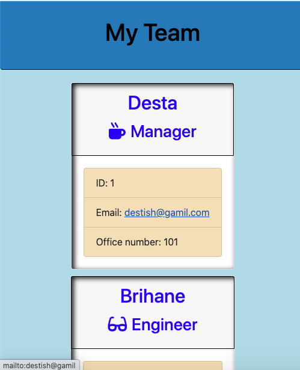

# Employee-team-profile-generator

 ## License
   

  
  # Table of Contents

   * [Installation Instructions](#installation-instructions)
  
   * [Usage Instructions](#usage-instructions)
  
   * [Contribution](#Contribution)
  
   * [Developers Contact Information](#Developers-Contact-Information)

   * [License](#license)

  # Description

   * This application is developed to help project developers to save time in generating thier README markdown clearly and briefly.

   * Developers can quickly and easily create a README file by using a command-line application to generate one. 

   * you can quickly create a employee-team-profile-generator.
   * My employee-team-profile-generator includes all necessary node_modules,  main Readme, screenshot image, and demonstration videos.
   * I put my LinkedIn profile, github and email address working activly.

  ## Installation Instructions

   * The developer is authorizing a free installation by cloning from the repository code [destish21/
   employee-team-profile-generator](https://github.com/destish21/employee-team-profile-generator).

   * you can run by install npm i to include node_module.

   * you can run by node app.js to generat profetional  employee-team-profile-generator.

   * 
  
  ## Usage Instructions

   * For the this app to run make sure first 
   intall the node_moduale.

   * make sure creat in your repository 

   * Copy the code from the code 
   * [destish21/
    employee-team-profile-generator](https://github.com/destish21/employee-team-profile-generator)
 
    employee-team-profile-generator and clone it in your comand line.

   * Make sure node_modules run by `npm i or npm installed`
     in your computer.

   * Once in the directory run npm install to install the node_modules needed to run the app.
    Run by `node app.js`

   * You will be prompted with questions.

   * A `README.md Successfull Generated!!`  will be desplayed after answering all the questions.

   * you will see high-quality, professional `employee-team-profile-generator` is generated with the title of my project.

   
   
   

   * My `employee-team-profile-generator` is in my repository enjoy it!

   * Test Screenshot image 
 
  
  
  ### Click the demo image to see video 1 and video 2 demonstration:  

  [Watch the video1](https://drive.google.com/file/d/13Ek5_a2yhRKBvolLvIwGzpphwaK5C_RB/view?usp=sharing)
  
  [Watch the video2](https://drive.google.com/file/d/1QeEtYFUPniLX8ZqN8y_NJk6BcEOSqoMB/view?usp=sharing)
    
  
  ## Contribution
  
   * This is Contributed by [destish21/employee-team-profile-generator](https://github.com/destish21/employee-team-profile-generator). 
   * But Contribution, issues and feature requests are welcome.
   * Feel free to check issues page if you want to contribute. 
   * you can contact me by Contact Information here below.

  ## Developers Contact Information
   * LinkdIn Profile: [Desta Mulualem](https://www.linkedin.com/in/desta-mulualem-6718b1203/)
   * Deployed URL :  https://destish21.github.io/employee-team-profile-generator/Develop/output/team.html
   * github URL: https://github.com/destish21/employee-team-profile-generator

   * Email: destish21@yahoo.com
   
